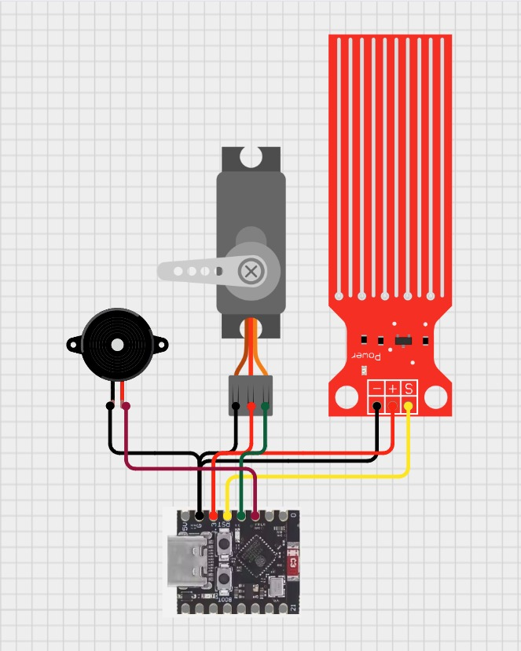

# posttest3-praktikum-iot-unmul-2026

Sistem Smart Dam merupakan integrasi teknologi Internet of Things (IoT) dengan MQTT yang memanfaatkan konektivitas nirkabel untuk memberikan peringatan dini terhadap ketinggian air pada bendungan. Melalui penggunaan mikrokontroler ESP32, sistem ini tidak hanya memungkinkan pengendalian pintu maupun sensor pada bendungan air, tetapi juga mengimplementasikan pemantauan kondisi secara real-time. Dengan integrasi sensor air dan protokol MQTT, maka sistem ini bisa menjadi solusi yang tepat dalam mengontrol bendungan air saat jaringan dalam kondisi yang tidak baik.

Proyek Sederhana ini disusun oleh kelompok 6 yang terdiri dari;
- Ammar Nabil Fauzan (2309106006)
- Zhorif Fachdiat (2309106014)
- Adhitya Fajar Al-Huda (2309106027)
- Muhammad Ghazali (2309106041)

### Pembagian Tugas

Agar proyek sederhana ini berjalan lancar, kami melakukan pembagian tugas berdasarkan keahlian masing-masing anggota
- Ammar bertugas untuk mengatur alur PubSub pada Kodular agar bisa mengontrol alat melalui ponsel
- Zhorif merangkai alat agar berfungsi dengan semestinya
- Fajar membuat desain tampilan aplikasi kodular mobile
- Ghazali mengoding agar data yang diterima sensor air dan PubSub pada ESP32 agar bisa berkomunikasi dengan MQTT, sehingga sesuai dengan skenario proyek.

Komponen yang digunakan pada proyek ini diantaranya;
1. 1 Esp32-Supermini-C3
2. 1 Sensor Water Level
3. 1 Servo
4. 1 Buzzer
5. 1 Kabel USB to C
6. 8 Kabel jumper

### Board Schematics

  

